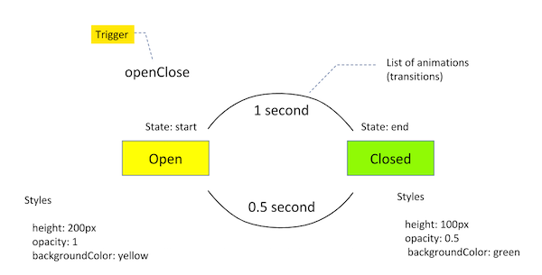
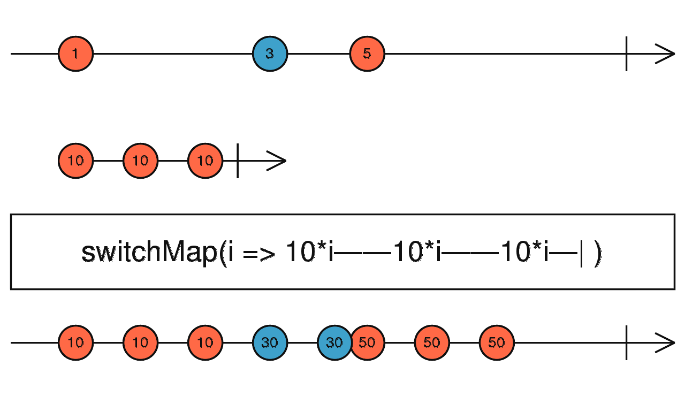
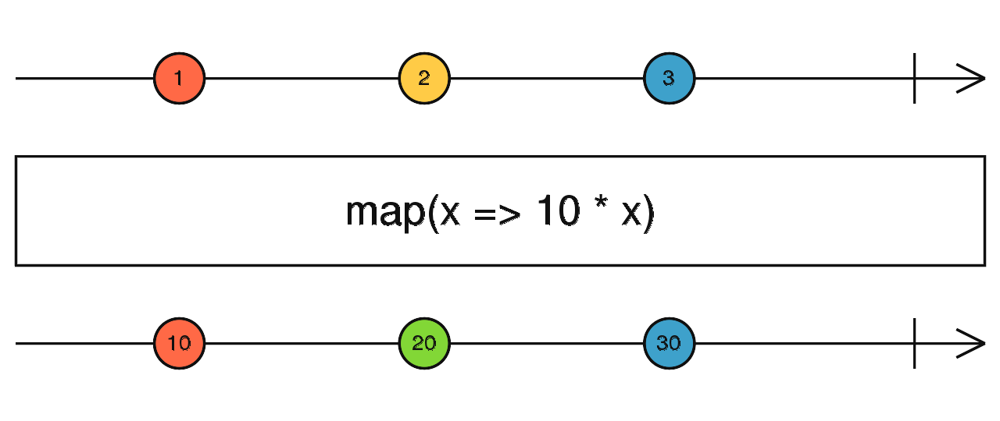

# title

## 0 How Synectics use it

    - Angular 8 as main framework
    - IDE we use Webstorm
    - Typescript as language for procedural code
    - HTML as GUI language
    - Material Design to build our 
    - RxJs
    - Redux

### Where to find it

    - New stuff: Technology Extensions Repo -> Frontend -> CloudServices Angular

## What I have learned

- Markdown language
- 

## 1 Getting started

### Setup Development Environment

    1. Get newest NodeJs from nodejs.org
    2. run _npm install -g npm_
    3. run _npm uninstall -g angular/cli_
    4. run _npm cache clean_
    5. run _npm install -g @angular/cli_

## 2 Basics

### Component

### Databinding: ngModel

> _\<input type="text" [(ngModel)]="name">_

It accepts a domain model as an optional Input. If you have a one-way binding to ngModel with [] syntax, changing the value of the domain model in the component class sets the value in the view. If you have a two-way binding with [()] syntax (also known as 'banana-box syntax'), the value in the UI always syncs back to the domain model in your class.

### Databinding: string interpolation

One way databinding from model to view

> _{{propertyName}}_

### Directive: ngIf

> \_\

>
> > Content to render when condition is true.
>
> \
\_

### Directive: ngFor

Example 1

> _\<app-server \*ngFor="let server of servers">\</app-server>_

Example 2

> \

> > \*ngFor="let logItem of log; let i = index"..\
> > [ngStyle]="{backgroundColor: i >= 4 ? 'blue' : 'transparent'}"\
> > [ngClass]="{'white-text': i >= 4}"\>\
> > {{ logItem }}
>
> \

### Directive: ngClass

> \

> > [ngClass]="{online: serverStatus === 'online'}">\
> > {{ 'Server' }} with ID {{ serverId }} is {{ getServerStatus() }}
>
> \

### Directive: ngStyle

> \

> > [ngStyle]="{backgroundColor: getColor()}"\
> > {{ 'Server' }} with ID {{ serverId }} is {{ getServerStatus() }}
>
> \

## 3 Course Project Basics

## 4 Debugging

### Use Chrome Debugging Tools

Open Chrome debugging tools after by pressing F12.

### Use SourceMaps

Angular CLI adds SourceMaps to Javascript files when it sets up bundles for the browser to get an reference between JavaScript files and TypeScript files. Only available in development mode. They are not provided in production
mode.

Access TypeScript files:

> Chrome-> F12 -> Sources -> top -> webpack -> . -> src -> app

Here you find your TypeScript file like in your dev environment.

### Use Augury

Augury is a chrome extension to debbug your Angular app.
You can see your Router, Components and Models. Helps you
understand and analyse your Angular app at runtime.

## 5 Databinding: Components & Databinding Deep Dive

### Component life cycle

| Event                 | Description                                                              |
| --------------------- | ------------------------------------------------------------------------ |
| ngOnChanges           | Called after a bound input property changes                              |
| ngOnInit              | Called once the component is initialized                                 |
| ngDoCheck             | Called during every change detection run                                 |
| ngAfterContentInit    | Called after content (ng-content) has been projected into view           |
| ngAfterContentChecked | Called every time the projected content has been checked                 |
| ngAfterViewInit       | Called after the component’s view (and child views) has been initialized |
| ngAfterViewChecked    | Called every time the view (and child views) have been checked           |
| ngOnDestroy           | Called once the component is about to be destroyed                       |

### @Input

Decorator that marks a class field as an input property and supplies configuration metadata. The input property is bound to a DOM property in the template. During change detection, Angular   matically updates the data property with the DOM property's value.

### @Output()

Decorator that marks a class field as an output property and supplies configuration metadata. The DOM property bound to the output property is   matically updated during change detection.

### EventEmitter\<type>

Use in components with the @Output directive to emit custom events synchronously or asynchronously, and register handlers for those events by subscribing to an instance.

> @Output() serverCreated = new EventEmitter<{serverName: string, serverContent: string}>();

### @ViewChild

Property decorator that configures a view query. The change detector looks for the first element or the directive matching the selector in the view DOM. If the view DOM changes, and a new child matches the selector, the property is updated.

### @ContentChild

Use to get the first element or the directive matching the selector from the content DOM. If the content DOM changes, and a new child matches the selector, the property will be updated.

Content queries are set before the ngAfterContentInit callback is called.

Does not retrieve elements or directives that are in other components' templates, since a component's template is always a black box to its ancestors.

## 6 Databinding: Course Project - Components & Databinding

## 7 Directives Deep Dive

An Attribute directive changes the appearance or behavior of a DOM element.

There are three kinds of directives in Angular:

    1. Components—directives with a template.
    2. Structural directives—change the DOM layout by adding and removing DOM elements.
        - ngif
        - ngfor
    3. Attribute directives—change the appearance or behavior of an element, component, or another directive.
        - ngclass
        - ngstyle

### Generate a directive by CLI

> ng generate directive \<directiveName>
>
> oder
>
> ng g d \<directiveName>

### Basic directive

Uses the **_ElementRef_** to change DOM element.

### Better directive with renderer

Uses the **_Renderer_** to change DOM element. This works
with service workers too! see <https://angular.io/guide/service-worker-intro>

It uses HostListener to execute code after some event occurred, like mouse or keyboard events.
It changes the DOM element by using the renderer. See commented lines in the picture above.

### Better directive using HostBinding

Decorator that marks a DOM property as a host-binding property and supplies configuration metadata. Angular   matically checks host property bindings during change detection, and if a binding changes it updates the host element of the directive.

This example uses HostBinding to change an attribute of a DOM element.

## 8 Course Project - Directives

## 9 Using Services & Dependency Injection

### Dependency Injector

Angular uses a **_Hierachical Injector_**. There are 3 level where you can provide a class.

    1. AppModule.ts
    2. AppComponent.ts
    3. SomeComponent.ts

### @Injectable registers a class into DI container root object

Decorator that marks a class as available to be provided and injected as a dependency.

**_providedIn: 'root'_** means it is registered in the root (=AppModule.ts)of the hierarchy.

### Inject into a class

> @Component({
>
> > provider: [ClassNameToProvideInAComponent]
>
> })

If you add the Class in provider array you get an new instance for this component. If you want an instance of a level more to the root, remove it from
the provider array.

Use
If you add a typed property in the constructor of a component class, Angular
injects an object of this class. Because Angular instanciate component classes.

### Inject a object into a class

Use @Injectable to tell Angular there needs to be at least one object injected into the constructor of this class.

This can be used to inject an object into a service.

## 10 Course Project - Services & Dependency Injection

## 11 Changing Pages with Routing

The browser is a familiar model of application navigation:

- Enter a URL in the address bar and the browser navigates to a corresponding page.
- Click links on the page and the browser navigates to a new page.
- Click the browser's back and forward buttons and the browser navigates backward and forward through the history of pages you've seen.

The Angular Router ("the router") borrows from this model. It can interpret a browser URL as an instruction to navigate to a client-generated view. It can pass optional parameters along to the supporting view component that help it decide what specific content to present. You can bind the router to links on a page and it will navigate to the appropriate application view when the user clicks a link. You can navigate imperatively when the user clicks a button, selects from a drop box, or in response to some other stimulus from any source. And the router logs activity in the browser's history journal so the back and forward buttons work as well.

### How to add to project

>src/app/app.module.ts (import)
>>import { RouterModule, Routes } from '@angular/router';

### Router outlet

The RouterOutlet is a directive from the router library that is used like a component. It acts as a placeholder that marks the spot in the template where the router should display the components for that outlet.

In html you need to add this:

>\<router-outlet>\</router-outlet>\
>\<!-- Routed components go here -->

### Define Routes

### href

If you use **href** browser loads whole application.

### RouterLink Directives

>\<a routerLink="/crisis-center" routerLinkActive="active">Crisis Center\</a>

A router link is used to navigate from one to another component like is defined
it in the routes.

A RouterLink Directives always nows it current route.

### RouterLinkActive Directive

>\<a routerLink="/crisis-center" routerLinkActive="active">Crisis Center\</a>

The RouterLinkActive directive toggles css classes for active RouterLink bindings based on the current RouterState.

### RouterLinkActiveOptions Directive

RouterLinkActiveOptions allows you to use active css for this link only if it is an excat match of the route.

>\<li role="presentation"
>>routerLinkActive="active"\
>>[routerLinkActiveOptions]="{exact: true}">\
>>\<a routerLink="/">Home\</a>
>
>\</li>

### Navigation through javascript code

>this.router.navigate(['servers'])

The Navigate method don't now what is the current route.

### Read more

<https://angular.io/guide/router>

## 12 Course Project - Routing

## 13 Understanding Observables

Observables provide support for passing messages between publishers and subscribers in your application. Observables offer significant benefits over other techniques for event handling, asynchronous programming, and handling multiple values.

Observables are declarative—that is, you define a function for publishing values, but it is not executed until a consumer subscribes to it. The subscribed consumer then receives notifications until the function completes, or until they unsubscribe.

An observable can deliver multiple values of any type—literals, messages, or events, depending on the context. The API for receiving values is the same whether the values are delivered synchronously or asynchronously. Because setup and teardown logic are both handled by the observable, your application code only needs to worry about subscribing to consume values, and when done, unsubscribing. Whether the stream was keystrokes, an HTTP response, or an interval timer, the interface for listening to values and stopping listening is the same.

Because of these advantages, observables are used extensively within Angular, and are recommended for app development as well.

### Defining observers

A handler for receiving observable notifications implements the Observer interface. It is an object that defines callback methods to handle the three types of notifications that an observable can send:

| NOTIFICATION TYPE | DESCRIPTION |
| - | - |
| next | Required. A handler for each delivered value. Called zero or more times after execution starts.
| error | Optional. A handler for an error notification. An error halts execution of the observable instance.
| complete | Optional. A handler for the execution-complete notification. Delayed values can continue to be delivered to the next handler after execution is complete. |

**_Always unsubscribe a subscription!_**

## 14 Course Project Observables

## 15 Handling Forms in Angular Apps

## 16 Course Project - Forms

## 17 Using Pipes to Transform Output

A pipe takes in data as input and transforms it to a desired output.

see <https://angular.io/guide/pipes>

### Pipe operator like in unix

{{ server.instanceType | uppercase }}

### Chaining pipes

You can add the output from one pipe to the input to another pipe.
The order is from left to right.

{{ server.started | date:'fullDate' | uppercase }}

### Convert a text to uppercase

{{ server.instanceType | uppercase }}

### Convert a datetime

{{ server.started | date:'fullDate' | uppercase }}

Sunday, August 8, 1920

If a pipe allows parameters it will be added an seperated by :

### Build in pipes

Build in pipes are documented at angular.io website.
Under documentation -> API reference and filter for pipes

### Create a new pipe with CLI

> ng generate pipe \<name of pipe>

or

> ng g p \<name of pipe>

### Pure pipe

> @pipe\
> {
>
> > name: nameOfPipe,\
> > pure: false; //default value is true
>
> }

When true, the pipe is pure, meaning that the transform() method is invoked only when its input arguments change. Pipes are pure by default.

If the pipe has internal state (that is, the result depends on state other than its arguments), set pure to false. In this case, the pipe is invoked on each change-detection cycle, even if the arguments have not changed.

### Create your own pipe

see folder "17 - pipes-final"

### async pipe

Use async pipe on promise and oberservables.

## 18 Making Http Requests

Call backend by using http calls.
Used to get data from a server or store data at a server.

### HTTP Verbs

    -POST
    -GET
    -PUT
    -OPTION
    Always call by the browser before a POST is called.
    -DELETE

### Create an Firebase backend

    -go to firebase.google.com
    -login with your google account
    -go to console at firebase.google.com
    -add a new firebase project
    -go to database and create a new realtime database
    -after creation you see a URL to send HTTP request to the database

### Setup a HTTP request

    -goto app.module.ts
    -Add HttpClientModule from @angular/common/http
    -go to your component and inject HttpClient from @angular/common/http
    -create a post request

> this.http
>
> > .post(
> >
> > > '<https://ng-complete-guide-c56d3.firebaseio.com/posts.json',>  
> > > postData
> >
> > )
> >
> > .subscribe(responseData => {
> >
> > > > console.log(responseData);
> >
> > }
>
> );

    You need to subscribe to this request otherwise the request gets not executed.

### Creating a get request

    - Get data
    - Set return type in get request.
    - Transform data
    - output our data

    -get:   Create a get request. Get is an generic method which can be extended by the return type of the request.
    -pipe:
        -map: Is used to transform type of responseData to postsArray.
    -subscribe:

### Handle errors

Each observable returns as a second parameter a way to access the error if available.

### Http Header and Query params

### Http response events and response type

Event Types can be - Sent - Response - ...

Response Types can be - Text - json - ...

### Http Interceptors

Intercepts and handles an HttpRequest or HttpResponse.

## 19 Course Project - Http

## 20 Authentication & Route Protection in Angular

## 21 Dynamic Components

## 22 Angular Modules & Optimizing Angular Apps

## 23 Deploying an Angular App

## 24 Bonus: Working with ngRx in our Project

### ngRx Overview

NgRx provides state management for creating maintainable explicit applications, by storing single state and the use of actions in order to express state changes.

    1. Store

A **store** holds the whole state tree of your application. The only way to change the state inside it is to dispatch an action on it.

    2. Action
**Actions** describe unique events that are dispatched from components and services.

    3. Reducer
State changes are handled by pure functions called **Reducers** that take the current state and the latest action to compute a new state.

    4. Effects
**Effects** are an RxJS powered side effect model for Store. Effects use streams to provide new sources of actions to reduce state based on external interactions such as network requests, web socket messages and time-based events.

    5. Selector

**Selectors** are pure functions used to select, derive and compose pieces of state.

    6. Component
A component controls a patch of screen called a view.

    7. Service
Components shouldn't fetch or save data directly and they certainly shouldn't knowingly present fake data. They should focus on presenting data and delegate data access to a service.

**Services** are a great way to share information among classes that don't know each other.

### Store

A store holds the whole state tree of your application. The only way to change the state inside it is to dispatch an action on it.

A store is not a class. It's just an object with a few methods on it. To create it, pass your root reducing function to createStore.

#### dispatch(action)

Dispatches an action. This is the only way to trigger a state change.

#### subscribe(listener)

Adds a change listener. It will be called any time an action is dispatched, and some part of the state tree may potentially have changed. You may then call getState() to read the current state tree inside the callback.

### Reducer

A reducer (also called a reducing function) is a function that accepts an accumulation and a value and returns a new accumulation. They are used to reduce a collection of values down to a single value.

Reducers are not unique to Redux—they are a fundamental concept in functional programming. Even most non-functional languages, like JavaScript, have a built-in API for reducing. In JavaScript, it's Array.prototype.reduce().

In Redux, the accumulated value is the state object, and the values being accumulated are actions. Reducers calculate a new state given the previous state and an action. They must be pure functions—functions that return the exact same output for given inputs. They should also be free of side-effects. This is what enables exciting features like hot reloading and time travel.

Reducers are the most important concept in Redux.

Do not put API calls into reducers.

### Action

type Action = Object

An action is a plain object that represents an intention to change the state. Actions are the only way to get data into the store. Any data, whether from UI events, network callbacks, or other sources such as WebSockets needs to eventually be dispatched as actions.

Actions must have a type field that indicates the type of action being performed. Types can be defined as constants and imported from another module. It's better to use strings for type than Symbols because strings are serializable.

Other than type, the structure of an action object is really up to you. If you're interested, check out Flux Standard Action for recommendations on how actions should be constructed.

### Effects

Effects are an RxJS powered side effect model for Store. Effects use streams to provide new sources of actions to reduce state based on external interactions such as network requests, web socket messages and time-based events.

### Redux devtools extensions

Visualize dispatched actions of your application and let you browse to your store data. You can also go back in time to simulate your application usage.

1. Add redux devtools to your browser.
2. npm install --save-dev @ngrx/store-devtools
3. restart ng serve
4. go to app.module.ts and add StoreDevtoolsModule from @ngrx/store-devtools
5. StoreDevtoolsModule.instrument({logOnly: environment.production})

### Router-store

Helps you analyse ngrx routing actions.

1. Add npm install --save @ngrx/router-store
2. go to app.module.ts and add StoreRouterConnectionModule from @ngrx/router-store
3. StoreRouterConnectingModule.forRoot()

## 25 Bonus: Angular Universal

## 26 Angular Animations

### How to add to project

- You probably need to install the new animations package (running the command never hurts): _npm install --save @angular/animations_
- Add the **BrowserAnimationsModule**  to your imports[]  array in AppModule
- This Module needs to be imported from @angular/platform-browser/animations'  => import { **BrowserAnimationsModule** } from '@angular/platform-browser/animations' (in the AppModule!)
- You then import trigger , state , style  etc from @angular/animations  instead of @angular/core

### How to add to components

### animations

In the component file, add a metadata property called animations: within the @Component() decorator. You put the trigger that defines an animation within the animations metadata property.

For more see Angular Website:
<https://angular.io/guide/animations>

Keyframe Animation
<https://angular.io/guide/transition-and-triggers>

## 27 Adding Offline Capabilities with Service Workers

## 28 A Basic Introduction to Unit Testing in Angular Apps

## 29 Angular Changes & New Features

## 30 Course Roundup

## 31 Custom Project & Workflow Setup

## 32 Bonus: TypeScript Introduction (for Angular 2 Usage

### ... Spread Operator

The spread operator is the opposite of destructuring. It allows you to spread an array into another array, or an object into another object. For example:

let first = [1, 2];
let second = [3, 4];
let bothPlus = [0, ...first, ...second, 5];

### Cast string to number

var x = "32";  
var y = +x; // y: number

#### truthy to true, falsy to false

var b = !!"2"; // the !! converts truthy to true, and falsy to false

## 34 rxjs

<<<<<<< HEAD
RxJS is a library for composing asynchronous and event-based programs by using observable sequences. It provides one core type, the Observable, satellite types (Observer, Schedulers, Subjects) and operators inspired by Array#extras (map, filter, reduce, every, etc) to allow handling asynchronous events as collections.

### operators

RxJS is a library for reactive programming using Observables, to make it easier to compose asynchronous or callback-based code. This project is a rewrite of Reactive-Extensions/RxJS with better performance, better modularity, better debuggable call stacks, while staying mostly backwards compatible, with some breaking changes that reduce the API surface

### Introduction

RxJS is a library for composing asynchronous and event-based programs by using observable sequences. It provides one core type, the Observable, satellite types (Observer, Schedulers, Subjects) and operators inspired by Array#extras (map, filter, reduce, every, etc) to allow handling asynchronous events as collections.

> Think of RxJS as Lodash for events.

ReactiveX combines the Observer pattern with the Iterator pattern and functional programming with collections to fill the need for an ideal way of managing sequences of events.

The essential concepts in RxJS which solve async event management are:

- Observable: represents the idea of an invokable collection of future values or events.
- Observer: is a collection of callbacks that knows how to listen to values delivered by the Observable.
- Subscription: represents the execution of an Observable, is primarily useful for cancelling the execution.
- Operators: are pure functions that enable a functional programming style of dealing with collections with operations like map, filter, concat, reduce, etc.
- Subject: is the equivalent to an EventEmitter, and the only way of multicasting a value or event to multiple Observers.
- Schedulers: are centralized dispatchers to control concurrency, allowing us to coordinate when computation happens on e.g. setTimeout or requestAnimationFrame or others.

### Mempory Leak

- Unscribe from a aubscription.

- Use **takeWhile** operator in the source to cleanup source by a given condition

- Use **takeUntil** operator in the source to cleanup source after a given time.

### Operators

#### switchMap

Projects each source value to an Observable which is merged in the output Observable, emitting values only from the most recently projected Observable.

Maps each value to an Observable, then flattens all of these inner Observables.

#### debounceTime

Emits a value from the source Observable only after a particular time span has passed without another source emission.

It's like delay, but passes only the most recent value from each burst of emissions.

#### bufferCount

Buffers the source Observable values until the size hits the maximum bufferSize given.

Collects values from the past as an array, and emits that array only when its size reaches bufferSize.

#### map

Applies a given project function to each value emitted by the source Observable, and emits the resulting values as an Observable.

#### of

Converts the arguments to an observable sequence

Like Array.prototype.map(), it passes each source value through a transformation function to get corresponding output values.

#### filter

Filter items emitted by the source Observable by only emitting those that satisfy a specified predicate.

Like Array.prototype.filter(), it only emits a value from the source if it passes a criterion function.

>>>>>>> 5857f464c0663eb1faab4805c5dec1097ad8b29d

#### tap

Perform a side effect for every emission on the source Observable, but return an Observable that is identical to the source.

#### fiter

Filter items emitted by the source Observable by only emitting those that satisfy a specified predicate.

#### take

Emits only the first count values emitted by the source Observable.

## 35 How to handle dev environment

### ng commands

#### Create new angular project

Creates a new Angular project.

> _ng new project \<projectname>_

#### Start development server

Start Angular live devolopment server.

> _ng serve_

#### ng generate component

Create a full component in src folder

> _ng generate component \<name>_

oder

> _ng g c \<name>_

### Install bootstrap

Install newest version of bootstrap

> _npm install --save bootstrap_

### Fix severity vulnerabilities

Fix severity vulnerabilities in project.

> _npm audit fix_

### manual project changes

a

#### add bootstrap to new project

Add "./node_modules/bootstrap/dist/css/bootstrap.min.css" line in .angular-cli.json file in app.styles array.

> see example 1.1
